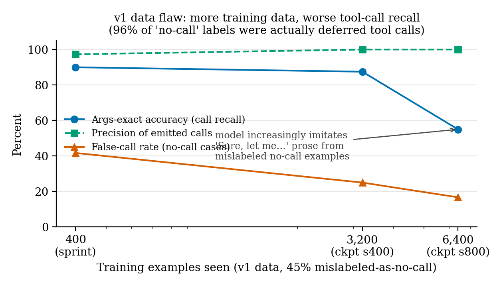

# PLaMo 3 NICT 2B — Tool-Calling LoRA

**Built with PLaMo.** This is, to our knowledge, the **first open-weights PLaMo model
with function calling**. PFN ships tool calling only in its API-only PLaMo Prime line;
all open PLaMo releases are base models. PLaMo 3's vocabulary, however, contains
chat/structured-output control tokens and the base repos ship an official
`chat_template.jinja` — this LoRA is trained directly on those rails.

> **Current revision = v2** (corrected data, 1,718 examples, 39 min on MPS):
> 100% parse / function / args-exact on the frozen 40 unseen call questions,
> 16.7% false-call on strict no-call cases. The original 400-example sprint
> adapter remains in `checkpoint-400/`. The v1 full-data run was **halted
> deliberately** after checkpoint evals exposed a training-label flaw — see
> "The v1 data flaw" below; the negative result is published, not hidden.

## Results

Single-turn tool-calling eval: 40 call + 12 no-call **unseen** queries (zero verbatim
overlap with training data — all rows below were measured on the rebuilt, leak-free
eval set; the earlier contaminated eval was discarded and is **not** shown anywhere),
greedy decoding, exact-match scoring:

| Condition | Parse rate | Func-name acc | Args exact | False-call rate |
|---|---|---|---|---|
| base, zero-shot | 35.0% | 32.5% | 0.0% | 0.0%¹ |
| base, 2-shot | 67.5% | 30.0% | 0.0% | 41.7% |
| **+ this LoRA, 400 ex. (current revision)** | **92.5%** | **92.5%** | **90.0%** | 41.7% |
| + LoRA v1 ckpt @ 3.2k ex. | 87.5% | 87.5% | 87.5% | 25.0% |
| + LoRA v1 ckpt @ 6.4k ex. (run halted) | 55.0% | 55.0% | 55.0% | 16.7% |
| + LoRA **v2** (fixed data, 1,718 ex., 39 min) | **100%** | **100%** | **100%** | **16.7%**² |

² v2 false-call: 12 **strict** no-call cases (call-free conversations); not
comparable to v1 rows' column (label flaw, below). Its 2 false calls are
tool-adjacent requests where no matching tool was listed (hallucinated function
instead of declining). Call-side questions identical across all rows.



## The v1 data flaw (why more data made it worse)

Checkpoint evals showed call recall degrading (90% → 87.5% → 55%) while precision of
emitted calls stayed ~100% — the model could call perfectly but increasingly chose
prose instead. Root cause: glaive conversations are multi-turn, and the assistant
often first asks a clarifying question ("How long should the password be?") before
calling the function in a later turn. Single-turn extraction labeled all such first
replies "no-call" — **96% of the v1 no-call class** — teaching the model that
tool-worthy requests deserve polite prose. Under a strict definition (no call
anywhere in the conversation), the entire 113k-row dataset contains only ~330
genuine no-call conversations. v2 trains on exactly those (318) plus 1,400 call
examples; deferred-clarification turns are excluded.

¹ trivially low — the zero-shot base model rarely emits a call at all.

Per-question predictions for every condition are in `eval/`. An earlier eval
measured 97.5% but was contaminated (41/52 queries leaked into training via
glaive's row duplication); it was discarded and rebuilt — details in the
[project repo](https://github.com/rajagurunath/pfn-plamo-inference-study).


## Usage

```python
import torch
from peft import PeftModel
from transformers import AutoModelForCausalLM, AutoTokenizer

base = "pfnet/plamo-3-nict-2b-base"   # gated: accept the PLaMo Community License
tok = AutoTokenizer.from_pretrained(base, trust_remote_code=True)
model = AutoModelForCausalLM.from_pretrained(base, trust_remote_code=True, dtype=torch.bfloat16)
model = PeftModel.from_pretrained(model, "Gurunath/plamo-3-nict-2b-tool-calling-lora")

messages = [
    {"role": "system", "content": (
        "You are a helpful assistant with access to the following tools. "
        "When the user's request requires a tool, respond with ONLY a JSON object "
        '{"name": <function-name>, "arguments": <args-object>}. '
        "If no tool is needed, answer normally.\nTools:\n"
        '{"name": "get_weather", "description": "Get current weather", '
        '"parameters": {"type": "object", "properties": {"location": {"type": "string"}}, '
        '"required": ["location"]}}')},
    {"role": "user", "content": "What's the weather in Osaka right now?"},
]
ids = tok.apply_chat_template(messages, add_generation_prompt=True, return_tensors="pt")
out = model.generate(ids, max_new_tokens=64, do_sample=False)
print(tok.decode(out[0][ids.shape[1]:], skip_special_tokens=True))
# {"name": "get_weather", "arguments": {"location": "Osaka"}}
```

## Training

- Base: `pfnet/plamo-3-nict-2b-base` (2.6B, attention-only), official chat template
- Data: 400 single-turn examples (350 call / 50 no-call) from
  `glaiveai/glaive-function-calling-v2` (Apache 2.0), query-level deduplicated
- LoRA r=16, α=32, all-linear, assistant-only loss masking, 1 epoch, bf16
- Hardware: MacBook Pro M4 Pro (Apple MPS) — **5 minutes** of training
- Full pipeline (data prep, training, eval):
  [github.com/rajagurunath/pfn-plamo-inference-study](https://github.com/rajagurunath/pfn-plamo-inference-study)

## License

Derivative of PLaMo 3 NICT 2B under the **PLaMo Community License** (see
`license_link`). Non-commercial use is free; commercial use is subject to PFN's
license terms — see the [license](https://huggingface.co/pfnet/plamo-3-nict-2b-base/blob/main/LICENSE/en)
and PFN's registration requirements. Training data is Apache 2.0.
